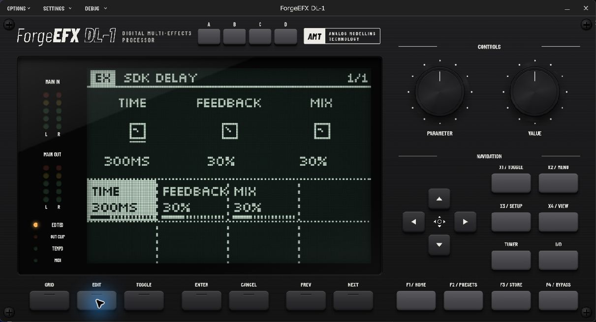
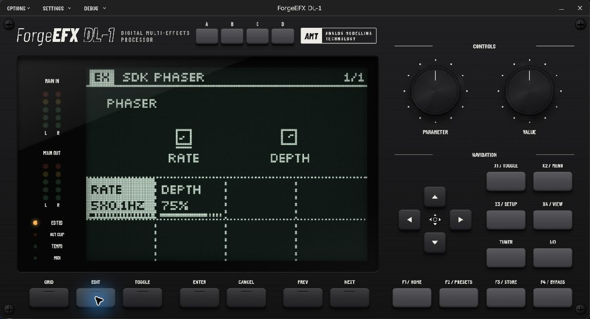
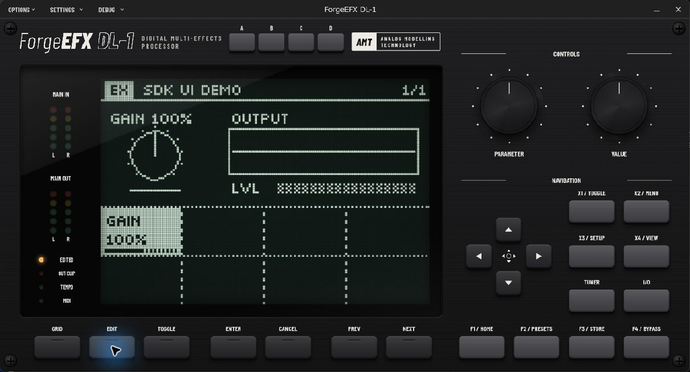

# ForgeEFX DL-1 Blocks SDK

SDK 1.0.0 with example effects and custom editors for building external ForgeEFX DL-1 blocks.
Includes the ABI headers, drawing-service bridge, CMake package generator,
compiled-module validator and working examples. No host checkout, JUCE,
firmware, effect catalog or model downloads are needed.

Analog circuit authors can use the bundled
[voltage helpers](sdk/README.md#analog-circuit-blocks) and the standard
5.62 V peak input / 4.04 V peak output convention per digital full scale.
Digital examples retain their existing Q16 behavior; ABI v1 is unchanged.

Visit [www.forgeefx.com](https://www.forgeefx.com/) for ForgeEFX product information.

New developers: start with [Getting Started](Getting%20Started.md) to build,
change, validate, and load your first block. Use the
[Development Guide](Development%20Guide.md) for the full workflow. Coding agents should
also read [AGENTS.md](AGENTS.md). The lower-level contract is in
[sdk/README.md](sdk/README.md) and [forgeefx_block.h](sdk/include/forgeefx_block.h).

## Bring your own effects to life with an AI agent

This project is pre-configured for LLM coding agents to help you create bespoke
DL-1 blocks. Open the SDK repository folder in your preferred agent and describe
the effect you want. The included [AGENTS.md](AGENTS.md) directs the agent to the
[Development Guide](Development%20Guide.md), SDK reference and manifest schema,
giving it the instructions it needs to build, test and package your ideas.

Ask for an emulation of a favourite analog pedal, invent a pedal that does not
exist yet, or explore sounds you have never heard before. Describe the character,
controls and behaviour you imagine, then refine the result with your agent as
you play and listen. Your imagination is the starting point.

Try a prompt like this:

> Read AGENTS.md and Development Guide.md, then help me build a bespoke DL-1
> block: a warm analog-style delay with slowly drifting echoes and a tone control.
> Build and validate it, then explain how to load it into DL-1 so I can try it.

## Examples in DL-1

The bundled examples loaded in the Windows DL-1 standalone host, shown at
their default parameter values.

**[Delay](examples/delay)** — a custom editor with Time, Feedback and Mix controls.



**[Phaser](examples/phaser/README.md)** — a minimal two-control modulation effect.



**[Responsive UI](examples/responsive_ui/README.md)** — gain feedback and an output
waveform display, shown here at 100% gain with no input signal.



## Quick start

Install CMake 3.22+, Python 3.10+, and a C11/C++20 compiler. On Windows use an
x64 Visual Studio developer terminal with the Windows SDK installed. On macOS
use Xcode command-line tools and install CMake and Python separately as needed.

```sh
git clone https://github.com/rm2kdev/ForgeEFX-DL-1-Blocks-SDK.git
cd ForgeEFX-DL-1-Blocks-SDK
cmake -S . -B build/native -DCMAKE_BUILD_TYPE=Release
cmake --build build/native --config Release --parallel
ctest --test-dir build/native -C Release --output-on-failure
```

The gain package is `build/native/dist/yourcompany.youreffect.fxblock/`.
The [delay demo](examples/delay) builds to
`build/native/dist/yourcompany.delay.fxblock/` and has a basic custom editor:

- Time: 1..1000 ms (default 300 ms).
- Feedback: 0..90% (default 30%); zero gives a single echo.
- Mix: 0..100% wet (default 30%); zero is dry, 100 is delayed audio only.

The examples use `yourcompany` and placeholder effect IDs. Replace these before
distributing your own block. The delay uses independent channel histories and
saturates its feedback and output to Q16 full scale. It deliberately omits tempo
sync, modulation and smoothing; changing Time during audio can click. Its
48,001 state words use approximately 188 KiB per channel. The declared 120-second
tail conservatively covers maximum feedback at the longest delay.

Build just the delay with the same SDK:

```sh
cmake -S examples/delay -B build/delay -DCMAKE_BUILD_TYPE=Release
cmake --build build/delay --config Release --parallel
```

When copying the delay outside this repository, pass
`-DFORGEEFX_SDK_DIR="/absolute/path/to/sdk"` at configure time.

Copy the entire package folder into a Blocks location scanned by the DL-1
host, then restart the host. Windows packages contain an x64 DLL; macOS packages
contain a dylib for the selected architecture. Build on each target platform.

See [VERIFICATION.md](VERIFICATION.md) for tested platforms and outstanding
listening/host checks, and [THIRD_PARTY_NOTICES.md](THIRD_PARTY_NOTICES.md) for
the export's scope and source provenance.

For a custom editor with a live waveform, gain feedback, and host-managed
responsive controls, see [the responsive UI demo](examples/responsive_ui/README.md).
It is included in the root build alongside the gain and delay examples.
